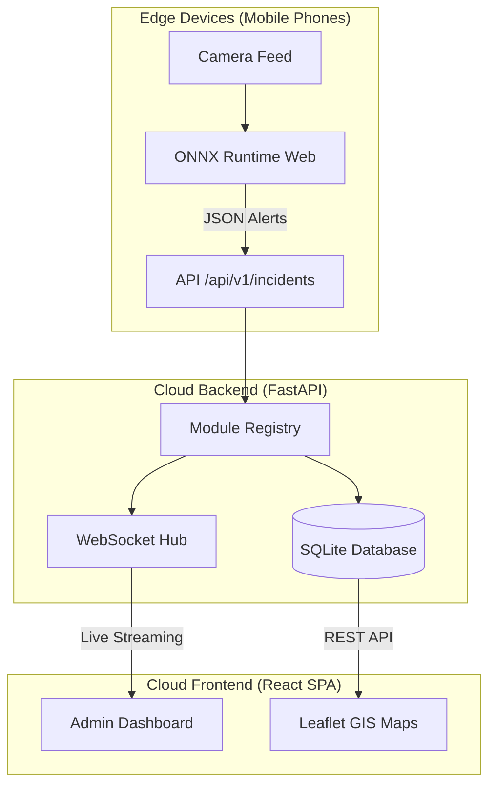

# MedAura - Smart City Infrastructure Platform 🏙️

[](https://vercel.com)
[](https://render.com)
[](#)

A modular, real-time Smart City monitoring platform designed to utilize edge AI (like mobile cameras) to detect infrastructure issues (e.g., potholes) and report them to a central cloud dashboard.

## 🏗️ Architecture



## 📂 Repository Structure

```text
MedAura/
├── backend/               # FastAPI Server & AI Logic
│   ├── ai/                # AI Inference Interfaces (PyTorch/ONNX)
│   ├── core/              # Database, WebSockets, Modularity
│   ├── modules/           # Pluggable detection modules
│   │   └── roadscan_ai/   # Default Module: Pothole Detection
│   └── main.py            # Entrypoint
├── frontend/              # React / Vite Web App
│   ├── src/
│   │   ├── core/          # Layout, Sidebar, API Client
│   │   ├── modules/       # Frontend counterparts to backend modules
│   │   └── pages/         # High-level views (Dashboard, etc.)
│   └── vercel.json        # Production Deployment Config
└── docs/                  # Extensive Architecture & Planning Docs
    └── ARCHITECTURE.md    # Full AI Judgment documentation
```

*(For a complete breakdown of the AI modeling, database schema, and ADRs, see [docs/ARCHITECTURE.md](./docs/ARCHITECTURE.md))*

## 🚀 Quick Start

### 1. Start the Backend
```bash
cd backend
python -m venv venv
venv\Scripts\activate      # On Windows
pip install -r requirements.txt
python -m uvicorn main:app --host 0.0.0.0 --port 8000
```

### 2. Start the Frontend
```bash
cd frontend
npm install
npm run dev
```

Visit `http://localhost:5173` to view the platform!

## ☁️ Deployment
- **Frontend**: Deployed via [Vercel](https://vercel.com).
- **Backend**: Configured for [Render](https://render.com) via `render.yaml` or Railway via `Procfile`.
